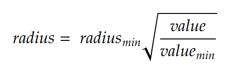

# Übungsblatt 2

## Allgemeines

**Abgabe:** bis Mi.13.01.2021, 23:55

Bearbeiten Sie die Aufgabe mit Hilfe von Repl.it WebIDE oder einer Entwicklungsumgebung Ihrer Wahl. Wichtig ist, dass Sie innerhalb der Abgabefrist Ihre Ergebnisse in Ihr GitHub Repository pushen. 

Schreiben sie in Ihrem Repository auch eine Dokumentation über Ihre Vorgehensweise, z.B. als Markdown-Datei (README.md)

Bearbeiten Sie die Aufgaben selbständig und nutzen Sie möglichst das Tutorium!
Bei Fragen und Unklarheiten benutzen Sie bitte das Diskussionsforum im Moodle.

**Dokumentation:** Dokumentieren Sie so viel wie nötig und so wenig wie möglich! Wichtig ist, dass Ihre Vorgehensweise nachvollziehbar und die Ergebnisse zu erkennen sind. Gegebenenfalls notieren Sie alle Befehlseingaben. 

## Webmapping mit OpenLayers
In diesem Übungsblatt sollen Sie eine Website mit 3 Unterseiten erstellen. Jede der 3 Unterseiten soll eine OpenLayers Karte enthalten. Alle Seiten sollen mit Hilfe einer Navigationsleiste erreichbar sein.

## 1) HTML, CSS (2 Punkte)
    Legen Sie zunächst alle .html Dateien an. Füllen Sie diese Datei mit einem html Grundgerüst. 
    
    Vernetzen Sie die 3 Seiten mit Hilfe einer Navigationsleiste.

## 2) Karte mit GeoJSON Daten und clientseitigem Styling (6 Punkte)

Thematische Karte zur Häufigkeit von Windrädern nach Bundesländern

    a) Binden sie die OpenLayers Bibliothek ein (CSS + JS). (1 P)
    b) Erzeugen Sie eine OpenLayers Karte mit einem OSM Hintergrundlayer. (1 P)
    c) Fügen Sie einen weiteren Vector Layer hinzu, als Quelle soll die Datei „bundeslaender.geojson“ verwendet werden (Flächen) (1 P)
    d) Fügen Sie noch einen weiteren Vector Layer hinzu, als Quelle soll die Datei „numberOfWindTurbinesByLand.geojson“ verwendet werden (Punkte).(1 P)
    e) Benutzen Sie eine Style-Funktion, welche die Fläche der dargestellten Kreise proportional zur Anzahl (value) skaliert. Benutzen Sie folgende Formel um den passenden radius für jedes Feature zu berechnen. (2 P)         

**_radiusmin_** bzw. **_valuemin_** entspricht dem Radius des kleinsten Symbols bzw. Wertes im Datensatz.

## 3) Karte mit remote Daten aus einem Tilecache (3 Punkte)

In dieser Teilaufgabe sollen Sie eine Karte (Tiles) von OSMLanduse (https://osmlanduse.org) mit OpenLayers einbinden.

    a) Binden sie die OpenLayers Bibliothek ein (CSS + JS). (1 P)
    b) Binden Sie nun den Layer „osmlanduse:osm_lulc_combined_osm4eo“ von OSMLanduse als Tile-Layer mit XYZ-Source ein. (2 P)
          
URL: https://maps.heigit.org/osmlanduse/tiles/osmlanduse:osm_lulc_combined_osm4eo/webmercator/{z}/{x}/{y}.png

## 4) Karte mit CSV Daten „upload“ (9 Punkte)
    a) Binden sie die OpenLayers Bibliothek ein (CSS + JS). (1 P)
    b) Erzeugen Sie eine OpenLayers Karte mit einem OSM Hintergrundlayer.(1 P)
       
      Ermöglichen Sie dem Nutzer Ihrer Webseite eigene Daten auf der Karte anzuzeigen.
    c) Fügen Sie hierzu ein HTML Element <input> vom Typ „file“ hinzu, um dem Nutzer die  Möglichkeit zu geben eine lokale Datei (CSV) von seinem Rechner auszuwählen.(1 P)
    d) Parsen sie die CSV Datei des Nutzers (Landeshauptstädte) mit der Bibliothek PapaParse. (2 P)
    e) Generieren Sie aus den eingelesenen Daten Features mit Punkt-Geometrien und Eigenschaften aus den Daten. (2 P)
    f) Fügen Sie einen Vector-Layer mit Vector-Source und Ihren zuvor generierten Features  der Karte hinzu (2 P)
